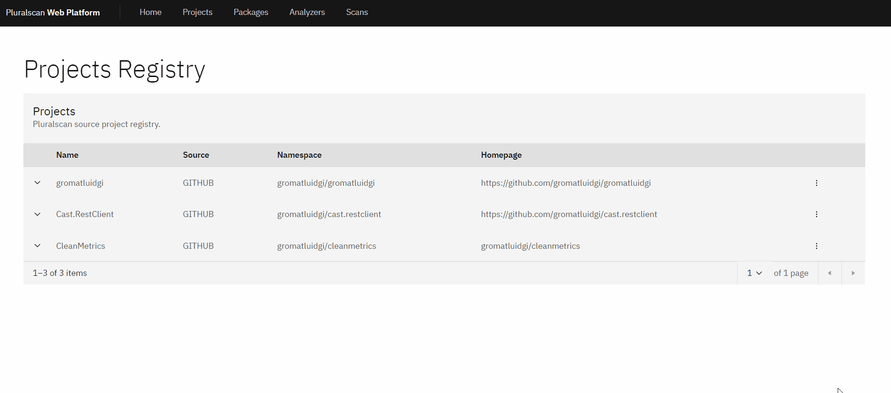
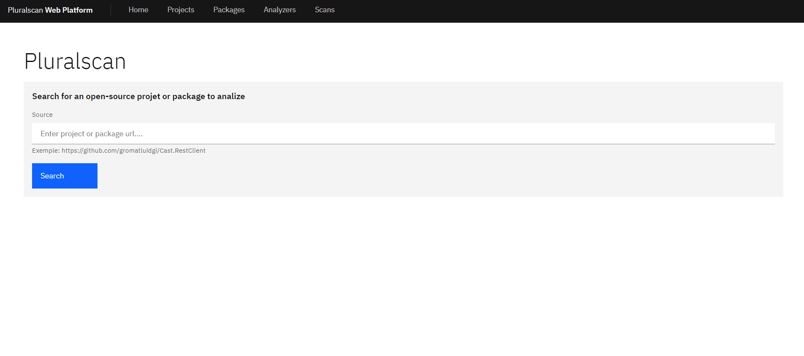
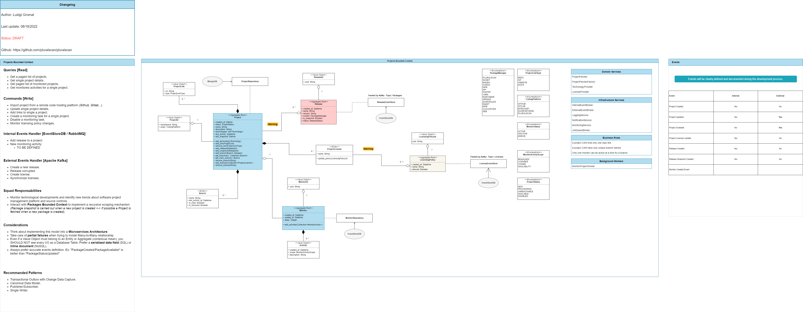
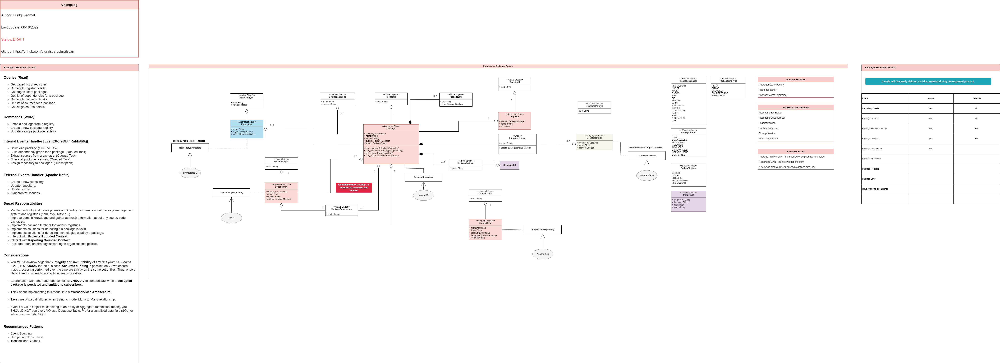
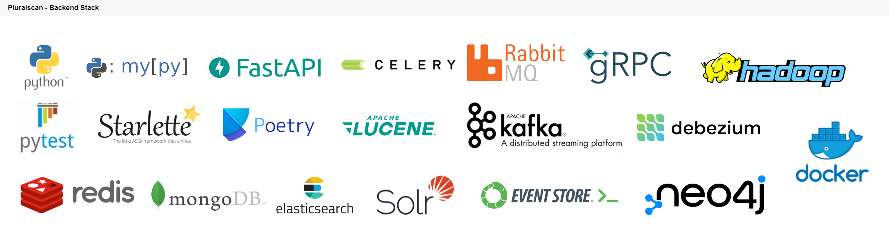
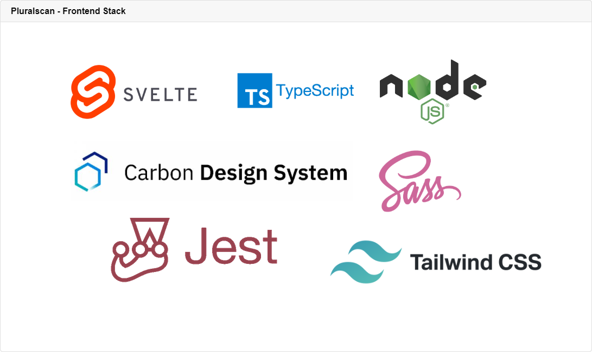
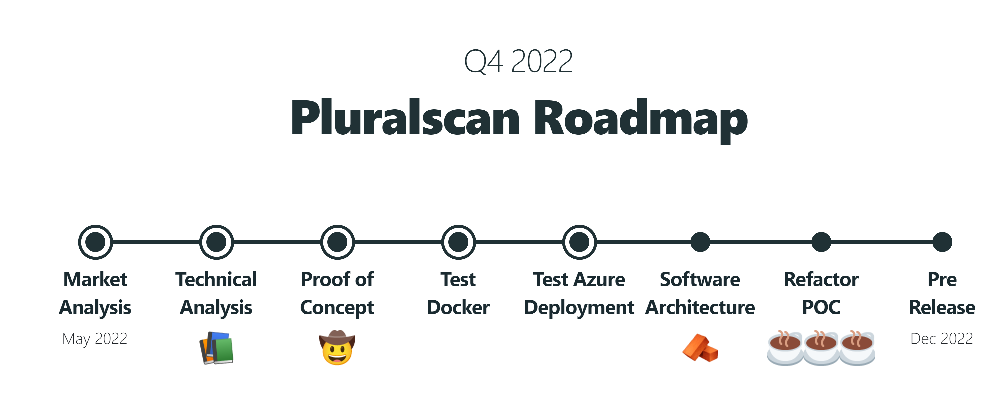

<h1 align="center">Pluralscan</h1>




Pluralscan is a source code analysis software, that's combine the best features of open sources security tools into a single solution. 
- Software Composition Analysis aka SCA.
- Static Application Security Testing aka [SAST](https://en.wikipedia.org/wiki/Static_application_security_testing).
- Dynamic Application Security Testing aka [DAST](https://en.wikipedia.org/wiki/Dynamic_application_security_testing).
- Code Quality Analysis with [Linter's](https://en.wikipedia.org/wiki/Lint_(software)).
- Active security testing with [Fuzzing Tools](https://en.wikipedia.org/wiki/Fuzzing).
- Prevents unwanted law complication by checking open source **license compliance**.
- Open source benchmarking.
- ...

## WARNING

Pluralscan should be currently considered as a **POC/POW project** that try to demonstrate how to realize a complexe business oriented software in Python by following **Domain Driven Design concepts**.

## Features

- Fetch open-source projects from **various locations** *(Git, Github, Gitlab, Disk...)*.
- Fetch software packages built with **various packaging systems** *(pip, poetry, npm, pip, cargo, go...)*
- Plan code analysis batch on a package with **various analyzers** *(Roslyn, Sonar, Security Code Scan...)*.
- Centralize and persist analysis reports into a **generic business model representation**.
- Monitor and provide assistance to reduce technical debt.



## Domain Model

Ongoing work, so many changes should be expected.

### Projects Bounded Context



### Packages Bounded Context



## Technologies

### Back



### Front



## Roadmap - Q4 2022



- Fast overview of software analysis concepts and markets.
- Study Python packages eco-system and estimate tech choices for API and presentation layers.
- Proof of concept partially driven by tests.
- Ensure that system can be run into Docker containers.
- Try cloud deployment to Azure App Service.
- Light Study Case (Bounded Context/Features...).
- Refactor POC into **Large Scale Distributed System** (Microservice + Eventsourcing) with agile development (Sprint/CI/CD).
- Supported coding languages:
	- Python
	- C
	- C++
	- C#
	- VB#
	- Go
	- Java
	- JavaScript
	- Typescript
	- PHP
	- Swift
	- Kotlin
	- Rust
	- Ruby
	- SQL
- Ensure at least 60% code coverage for whole project and **100% for any Command/CommandHandler/EventHandler !**

## Getting started with Docker

### docker-compose

Setup a complete stack with MongoDB, Redis and Pluralscan.
```bash
docker-compose up
```

Remove containers.
```bash
docker-compose down
```

### Check Redis

- Navigate to http://localhost:8001
- Accept RedisInsight license.
- Login with the password defined inside `.docker.env`

### Check Mongo

- Navigate to http://localhost:

### Check Apache Solr

- Navigate to http://localhost:8983

## Stack Overview

### Core Developement

- **Python 3.10** as language and runtime environment.
- [asyncio](https://docs.python.org/3/library/asyncio-task.html#coroutine) to declare coroutines and execute concurrent code
- [poetry](https://python-poetry.org/) for packaging and dependency management.
- [pytest](https://docs.pytest.org/en/7.1.x/) framework for testing.
- [pytest-cov](https://pytest-cov.readthedocs.io/en/latest/readme.html)
- [mypy](https://github.com/python/mypy) for static type checking.

#### Recommendation

- Use [pathlib]() for handling cross-platform file path.

### Backend Web Application (API)

- **Python 3.10*** as language and runtime environment.
- [FastApi]() is used as web framework used for API and serving SPA.
- [asyncio](https://docs.python.org/3/library/asyncio-task.html#coroutine) is used to declare coroutines and execute concurrent code.
- [esdbclient](https://github.com/pyeventsourcing/esdbclient) as gRPC client for EventStoreDB.
- [Celery]()
- [python-kafka]()
- [grpcio]()
- [grpcio-tools]()
- [pymongo]()
- [sse-starlette]() for performs Server Sent Event.
- [uvicorn]()
- [pydantic]()

### Front-end Web Application

- **NodeJS 16.13.0** as runtime environment.
- **Typescript** as main language.
- [Svelte 3](https://svelte.dev/) as front-end framework.
- [Carbon Design System for Svelte]() as design framework. 
- [jest](https://jestjs.io/fr/) as testing framework.
- [ts-jest](https://github.com/kulshekhar/ts-jest) for writing tests in Typescript.
- [svelte-jester](https://github.com/svelteness/svelte-jester) for precompile svelte components before importing them in to tests.
- [tailwindcss](https://tailwindcss.com/) as utility css framework.
- [PouchDB]() used to sync data from CouchDB Server on client device for offline usage.

### Commandline CLI Application

- **Python 3.10*** as language and runtime environment
- [asyncio](https://docs.python.org/3/library/asyncio-task.html#coroutine) to declare coroutines and execute concurrent code


## Technologies Overview

### Data Management & Persistence

- InMemory
- MongoDB
- Redis
 ElasticSearch
- [CouchDB]() used to persist data that's can be sync on client for offline usage.
- [EventSourceDB]()
- [Apache Cassandra]()
- [Apache Solr](https://solr.apache.org/)
- [debezium]()

### Messaging

- [RabbitMQ]()
- [Apache Kafka]()

### Containerization

- Docker

### Cloud Infrastructure

- Azure App Service
- Azure Registry

### Static Code Analyzis Tools

#### Security Analysis

- [KICS - Keeping Infrastructure as Code Secure](https://github.com/Checkmarx/kics) [Cloud]
- [Security Code Scan](https://security-code-scan.github.io/) **[C# | VB#]**
- [OWASP Dependency Check](https://github.com/jeremylong/DependencyCheck)

#### Linters

- [Staticcheck](https://github.com/dominikh/go-tools) **[Go]**
- [pylint](https://github.com/PyCQA/pylint) **[Python]**
- [cpplint](https://github.com/cpplint/cpplint) **[C | C++]**
- [Roslynator](https://github.com/JosefPihrt/Roslynator) **[C# | VB#]**
- [SQLFluff](https://github.com/sqlfluff/sqlfluff) **[SQL]**
- [Checkstyle](https://github.com/checkstyle/checkstyle) **[Java]**
- [ESLint](https://github.com/eslint/eslint) **[Javascript | Typescript]**
- [prettier](https://github.com/prettier/prettier) **[Javascript | Typescript]**
- [ktlint](https://github.com/pinterest/ktlint) **[Kotlin]**
- [php](https://github.com/php/php-src) **[PHP]**
- [rubucop](https://github.com/rubocop/rubocop) **[Ruby]**
- [clippy](https://github.com/rust-lang/rust-clippy) **[Rust]**
- [SwiftLint](https://github.com/realm/SwiftLint) **[Swift]**

## Development

### Recommended IDE Setup

[VSCode](https://code.visualstudio.com/) with:

#### Extensions for Python

- [Python](https://marketplace.visualstudio.com/items?itemName=ms-python.python)

#### Extensions for Svelte

- [Svelte](https://marketplace.visualstudio.com/items?itemName=svelte.svelte-vscode)

### Core

**Location:** pluralscan-core

**Language:** Python 3.10

**Architecture:** 

Pluralscan adopt a Clean Architecture/Onion Architecture/Ports & Adapters (Hexagonal) with Tactical DDD Patterns for each microservices... All boil down to the dependency inversion principle: **high-level modules** (the domain) **MUST NOT** depend on **low-level** ones (the infrastructure). Each bounded context has it's own set of modules.

#### Domain

The domain encapsulate a user or business concern that can be used to draw clear boundaries around features integration.

- **Entity**: An entity is an object that has an independent identifier and a lifecycle.
- **Aggregate**: An aggregate is a collection of one or more related entities. An aggregate has a root entity called the aggregate root. Aggregates can also contain references to other entities, but not the referenced entity metadata. It’s then up to the consuming services to call other services to synthesize the entity references.
- **Value Object**: Value objects contain metadata related to a given entity; they’re also tied to the lifecycle of the given entity.
- **Domain Events**:
  - If you **dispatch the domain events right before committing the original transaction**, it is because you want the side effects of those events to be included in the same transaction. This recommandation is applicable according to the ORM transaction mecanisms used in a given domain.

#### Application

The Application package references the Domain package.

This project is using DTO to define commands, queries, and their respective use cases. The use cases are the processes that can be triggered in our Application Core by one or several User Interfaces in our application.

This package also defines abstract interactors that are used for things like **Data Access** or **Business Logic Processing** inside the use-cases. However, the implementation for the interfaces lives in the Infrastructure package.

#### Data

The data folder contains sub-packages related to data access implementation.


#### Infrastructure

This package contains the implementation for the interfaces defined in the Application package.

### Commandline

TODO.

### Web Application

#### **Svelte SPA (Single Page Application)**

##### Install

```bash
cd pluralscan-svelte
npm install
```

##### Run Svelte Rollup Dev Server (Hot Reloading)

```bash
cd pluralscan-svelte
npm run dev
```

##### Build and upgrade front-end libs (until npm)

###### Powershell
```powershell
cd pluralscan-svelte
npm run build
```

The build process will output directly into  the API project.

##### Check

To verifiy if the project is error free, you can use the CLI tool svelte-check. It acts like an editor asking for errors against all of .svelte files.

```bash
npx svelte-check
```

#### **FastApi Backend + SSR (Server Side Rendering)**

##### Run development server (Windows)

```powershell
cd scripts
./run_fastapi_dev.ps1
```

##### Debug

From VS Code Debug View, run the "Debug FastApi" profile for start a dev web service with debuging.

## Tests

### Usecases

- [Shedule Package Scan](pluralscan-core/src/__tests__/integration_tests_application/usecases/scans/test_schedule_scan.py)
- [Scan Package](pluralscan-core/src/__tests__/integration_tests_application/usecases/scans/test_run_scan.py)

### Scan Package

## Coverage
https://coverage.readthedocs.io/

**Code coverage analysis with HTML report**

```powershell
py -m coverage html --skip-empty
cd htmlcov
```

## References

### Books

- [Domain-Driven Design: Tackling Complexity in the Heart of Software]() by **Eric Evans**
- [Implementing Domain-Driven Design]() by **Vaughn Vernon**
- [Patterns, Principles, and Practices of Domain-Driven Design]() by **Scott Millett**
- [Clean Architecture: A Craftsman's Guide to Software Structure and Design: A Craftsman's Guide to Software Structure and Design]() by **Robert C. Martin** aka "Uncle Bob"
- [Living Documentation: Continuous Knowledge Sharing By Design]() by **Cyrille Martraire**

### Python

- [PEP 563 – Postponed Evaluation of Annotations](https://peps.python.org/pep-0563/)
- [ABC - Abstract Base Class](https://docs.python.org/3/library/abc.html?highlight=metaclass)

### DDD

#### Methodology

- [The Bounded Context Canvas](https://github.com/ddd-crew/bounded-context-canvas)

#### Events

- [Handle events consistancy - Committing before dispatching](https://enterprisecraftsmanship.com/posts/domain-events-simple-reliable-solution/)

## Usefull resources

- [SVG Repo](https://www.svgrepo.com/)
- [PNG Repo](https://www.pngrepo.com/)