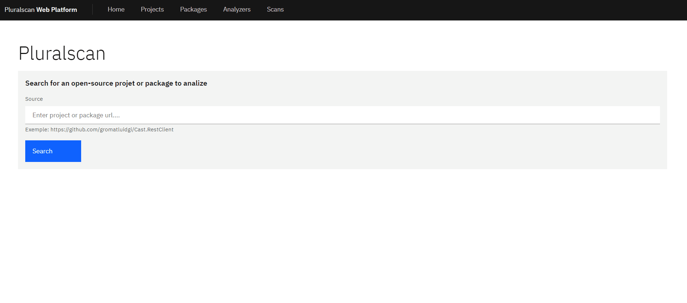

# Pluralscan




Pluralscan is a quality and security analysis platform aimed to provides a single solution for :
- Static Application Security Testing (SAST)
- Software Composition Analysis (SCA)
- License Checking
- Code Quality Analisys
- Open-souce solution benchmarking

## Abstract

Pluralscan should be currently considered as a **POC/POW project** that try to demonstrate how to realize a complexe business oriented software in Python by following **clean architecture practices**.

## Goals

- Fetch source code from **various locations** *(Git, Github, Gitlab, Disk...)*.
- Fetch package built with **various packaging systems** *(pip, poetry, npm, pip, cargo...)*
- Perform code analysis on a package with **various analyzers** *(Roslyn, Sonar, Security Code Scan...)*.
- Centralize and persist analysis reports into a **generic business model representation**.


## Roadmap

### Pre-Release

- Ensure validation logic exists for each layer of pluralscan-core.
- Ensure consistency
- Review any entities identifier and **prefer natural identifier** when possible.
- At least 60% code coverage for pluralscan-core.
- Logging.
- Clean exception handling.
- Documentation for pluralscan-core.
- Documentation for API.

### Release V1

- Move from Svelte 3 to **Svelte Kit**
  - Justification: Even if svelte kit is still in beta, must have features likes routing are natively implemented. However, the opinated way to realize scallable and maintenable front-end application, is the foremost reason of this choice.
- Implements abstract filesystem for stored resources *(packages, source code, tools...)*
- Build a rules registry:
  - Mapper:
    - Dependency Check
    - Roslyn
    - ...
- Ensure aggregates consistency.
- Ensure scalability.


## Main Convention

- Hint Typing

## Try with Docker

### docker-compose

Setup a complete stack with MongoDB, Redis and Pluralscan.
```bash
docker-compose up
```

Remove containers.
```bash
docker-compose down
```


### Build and run fresh image

##### Ubuntu

```bash
mkdir pluralscan
cd pluralscan
git clone https://github.com/pluralscan/pluralscan.git
docker build -t pluralscan/pluralscan .
docker run -dp 5400:5400 pluralscan/pluralscan
```

### First usage

#### Check Redis

- Navigate to http://localhost:8001
- Accept RedisInsight license.
- Login with the password defined inside `.docker.env`

#### Check Mongo

- Navigate to http://localhost:

## Stack Overview

### Core Business Packages

- **Python 3.10** as language and runtime environment.
- [poetry](https://python-poetry.org/) for packaging and dependency management.
- [pytest](https://docs.pytest.org/en/7.1.x/) framework for testing.
- [pytest-cov](https://pytest-cov.readthedocs.io/en/latest/readme.html)
- [mypy](https://github.com/python/mypy) for static type checking.

#### Recommendation

- Use [pathlib]() for handling cross-platform file path.


### Commandline CLI Application

- **Python 3.10*** as language and runtime environment

### Backend Web Application (API + Front Serving)

- **Python 3.10*** as language and runtime environment
- [FastApi]() as web framework used for API and serving SPA
- [python-rq](https://python-rq.org/) for queuing jobs and process them in background with workers **(Redis is required)**.

### Front-end Web Application

- **NodeJS 16.13.0** as runtime environment.
- **Typescript** as main language.
- [Svelte 3](https://svelte.dev/) as front-end framework.
- [Carbon Design System for Svelte]() as design framework. 
- [jest](https://jestjs.io/fr/) as testing framework.
- [ts-jest](https://github.com/kulshekhar/ts-jest) for writing tests in Typescript.
- [svelte-jester](https://github.com/svelteness/svelte-jester) for precompile svelte components before importing them in to tests.
- [tailwindcss](https://tailwindcss.com/) as utility css framework.

### Data Management & Persistence

- Memory
- MongoDB 5+
- Redis

### Containerization

- Docker 
- docker-compose 3.9

### Cloud Infrastructure

- Azure App Service
- Azure Registry

### Static Code Analyzis Tools

- Security Code Scan
- Dependency Check
- Roslyn
- Roslynator
- SonarQube
- KICS

## Development

### Recommended IDE Setup

[VSCode](https://code.visualstudio.com/) with:

#### Extensions for Python

- [Python](https://marketplace.visualstudio.com/items?itemName=ms-python.python)

#### Extensions for Svelte

- [Svelte](https://marketplace.visualstudio.com/items?itemName=svelte.svelte-vscode)

### Core

**Location:** pluralscan-core

**Language:** Python 3.10

**Architecture:** 

Pluralscan adopt a Monolith Clean Architecture/Onion Architecture/Ports & Adapters (Hexagonal) with Tactical DDD Patterns... all these are pretty much names for the same thing, and they all boil down to the dependency inversion principle: **high-level modules** (the domain) **MUST NOT** depend on **low-level** ones (the infrastructure). All those layers provides modules specific module according to bounded context.

#### Domain

The domain encapsulate a user or business concern that can be used to draw clear boundaries around features integration.

- **Entity**: An entity is an object that has an independent identifier and a lifecycle.
- **Aggregate**: An aggregate is a collection of one or more related entities. An aggregate has a root entity called the aggregate root. Aggregates can also contain references to other entities, but not the referenced entity metadata. It’s then up to the consuming services to call other services to synthesize the entity references.
- **Value Object**: Value objects contain metadata related to a given entity; they’re also tied to the lifecycle of the given entity.
- **Domain Events**:
  - If you **dispatch the domain events right before committing the original transaction**, it is because you want the side effects of those events to be included in the same transaction. This recommandation is applicable according to the ORM transaction mecanisms used in a given domain.

#### Application

The Application package references the Domain package.

This project is using DTO to define commands, queries, and their respective use cases. The use cases are the processes that can be triggered in our Application Core by one or several User Interfaces in our application.

This package also defines abstract interactors that are used for things like **Data Access** or **Business Logic Processing** inside the use-cases. However, the implementation for the interfaces lives in the Infrastructure package.


#### Data

The data folder contains sub-packages related to data access implementation.

Pluralsec currently provides implementation for persist data insides **Memory** and **MongoDB**.

#### Infrastructure

This package contains the implementation for the interfaces defined in the Application package.

### Commandline

TODO.

### Web Application

#### **Svelte SPA (Single Page Application)**

##### Install

```bash
cd pluralscan-svelte
npm install
```

##### Run Svelte Rollup Dev Server (Hot Reloading)

```bash
cd pluralscan-svelte
npm run dev
```

##### Build and upgrade front-end libs (until npm)

###### Powershell
```powershell
cd pluralscan-svelte
npm run build
```

The build process will output directly into  the API project.

##### Check

To verifiy if the project is error free, you can use the CLI tool svelte-check. It acts like an editor asking for errors against all of .svelte files.

```bash
npx svelte-check
```

#### **FastApi Backend + SSR (Server Side Rendering)**

##### Run development server (Windows)

```powershell
cd scripts
./run_fastapi_dev.ps1
```

##### Debug

From VS Code Debug View, run the "Debug FastApi" profile for start a dev web service with debuging.

## Tests

### Usecases

- [Shedule Package Scan](pluralscan-core/src/__tests__/integration_tests_application/usecases/scans/test_schedule_scan.py)
- [Scan Package](pluralscan-core/src/__tests__/integration_tests_application/usecases/scans/test_run_scan.py)

### Scan Package

## Coverage
https://coverage.readthedocs.io/

**Code coverage analysis with HTML report**

```powershell
py -m coverage html --skip-empty
cd htmlcov
```

## References

### Masters

- Vaughn Vernon - Implementing Domain Design

### Python

- [PEP 563 – Postponed Evaluation of Annotations](https://peps.python.org/pep-0563/)

### DDD

#### Methodology

- [The Bounded Context Canvas](https://github.com/ddd-crew/bounded-context-canvas)

#### Events

- [Handle events consistancy - Committing before dispatching](https://enterprisecraftsmanship.com/posts/domain-events-simple-reliable-solution/)

## Usefull resources

- [SVG Repo](https://www.svgrepo.com/)