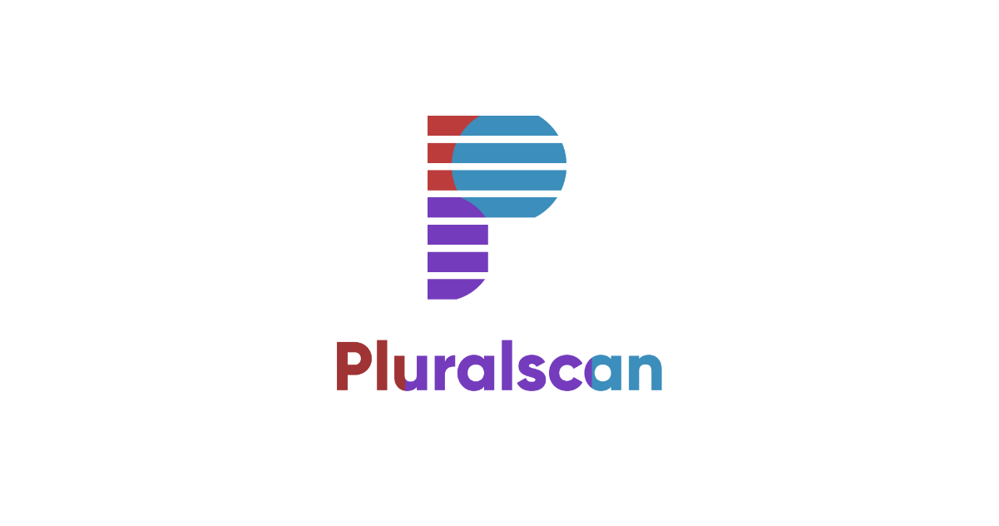

Pluralscan is a source code analysis software, that's combine the best features of open sources security tools into a single solution. 
- Software Composition Analysis aka SCA
- Static Application Security Testing aka [SAST](https://en.wikipedia.org/wiki/Static_application_security_testing)
- Dynamic Application Security Testing aka [DAST](https://en.wikipedia.org/wiki/Dynamic_application_security_testing)
- Code Quality Analysis with [Linter's](https://en.wikipedia.org/wiki/Lint_(software))
- Active security testing with [Fuzzing Tools](https://en.wikipedia.org/wiki/Fuzzing)
- Prevents unwanted law complication by checking open source **license compliance**
- Benchmark results provided by different tools
- ...


## WARNING

Pluralscan should be currently considered as a **POC/POW project** that try to demonstrate how to realize a complexe business oriented software in Python by following **Domain Driven Design concepts**.

## Features

- Fetch open-source projects from **various locations** *(Git, Github, Gitlab, Disk...)*.
- Fetch software packages built with **various packaging systems** *(pip, poetry, npm, pip, cargo, go...)*
- Plan code analysis batch on a package with **various analyzers** *(Roslyn, Sonar, Security Code Scan...)*.
- Centralize and persist analysis reports into a **generic business model representation**.
- Monitor and provide assistance to reduce technical debt.


## Team Shared Vision


## Domain Model

Ongoing work, so many changes should be expected.

### Projects Management


### Packages Management Domain


### Security Tools Domain


### Scan Proces Domain


## Roadmap from June 2022 to December 2022


## Getting started with Docker

### docker-compose

Setup a complete stack with MongoDB, Redis and Pluralscan. (Known issue with analyzer execution, fix comming soon)
```bash
docker-compose up
```

Remove containers.
```bash
docker-compose down
```

### Check Redis

- Navigate to http://localhost:8001
- Accept RedisInsight license.
- Login with the password defined inside `.docker.env`

### Check Mongo

- Navigate to http://localhost:

### Check Apache Solr

- Navigate to http://localhost:8983

## Stack Overview

### Core Developement

- **Python 3.10** as language and runtime environment.
- [asyncio](https://docs.python.org/3/library/asyncio-task.html#coroutine) to declare coroutines and execute concurrent code
- [poetry](https://python-poetry.org/) for packaging and dependency management.
- [pytest](https://docs.pytest.org/en/7.1.x/) framework for testing.
- [pytest-cov](https://pytest-cov.readthedocs.io/en/latest/readme.html)
- [mypy](https://github.com/python/mypy) for static type checking.

#### Recommendation

- Use [pathlib]() for handling cross-platform file path.

### Backend Web Application (API)

- **Python 3.10*** as language and runtime environment.
- [FastApi]() is used as web framework used for API and serving SPA.
- [asyncio](https://docs.python.org/3/library/asyncio-task.html#coroutine) is used to declare coroutines and execute concurrent code.
- [esdbclient](https://github.com/pyeventsourcing/esdbclient) as gRPC client for EventStoreDB.
- [Celery]()
- [python-kafka]()
- [grpcio]()
- [grpcio-tools]()
- [pymongo]()
- [sse-starlette]() for performs Server Sent Event.
- [uvicorn]()
- [pydantic]()

### Front-end Web Application

- **NodeJS 16.13.0** as runtime environment.
- **Typescript** as main language.
- [Svelte 3](https://svelte.dev/) as front-end framework.
- [Carbon Design System for Svelte](https://github.com/carbon-design-system/carbon-components-svelte) as design framework. 
- [jest](https://jestjs.io/fr/) as testing framework.
- [ts-jest](https://github.com/kulshekhar/ts-jest) for writing tests in Typescript.
- [svelte-jester](https://github.com/svelteness/svelte-jester) for precompile svelte components before importing them in to tests.
- [tailwindcss](https://tailwindcss.com/) as utility css framework.
- [PouchDB](https://pouchdb.com/) used to sync data from CouchDB Server on client device for offline usage.

### Commandline CLI Application

- **Python 3.10*** as language and runtime environment
- [asyncio](https://docs.python.org/3/library/asyncio-task.html#coroutine) to declare coroutines and execute concurrent code


## Technologies Overview

### Data Management & Persistence

- InMemory - only for tests purpose
- [MongoDB](https://www.mongodb.com/fr-fr)
- [Redis](https://redis.io/)
- [ElasticSearch](https://www.elastic.co/fr/elasticsearch/)
- [Apache CouchDB](https://couchdb.apache.org/) used to persist data that's can be sync on client for offline usage.
- [EventStoreDB](https://www.eventstore.com/)
- [Neo4j](https://neo4j.com/)
- [Apache Solr](https://solr.apache.org/)
- [debezium](https://debezium.io/)

### Messaging

- [RabbitMQ](https://www.rabbitmq.com/)
- [Apache Kafka](https://kafka.apache.org/)

### Containerization

- [Docker](https://www.docker.com/)
- [Kubernetes](https://kubernetes.io/)


### Cloud Infrastructure

- [Azure App Service]()
- [Azure Container Registry]()

### Static Code Analyzis Tools

#### Security Analysis

- [KICS - Keeping Infrastructure as Code Secure](https://github.com/Checkmarx/kics) [Cloud]
- [Security Code Scan](https://security-code-scan.github.io/) **[C# | VB#]**
- [OWASP Dependency Check](https://github.com/jeremylong/DependencyCheck)

#### Linters

- [Staticcheck](https://github.com/dominikh/go-tools) **[Go]**
- [pylint](https://github.com/PyCQA/pylint) **[Python]**
- [cpplint](https://github.com/cpplint/cpplint) **[C | C++]**
- [Roslynator](https://github.com/JosefPihrt/Roslynator) **[C# | VB#]**
- [SQLFluff](https://github.com/sqlfluff/sqlfluff) **[SQL]**
- [Checkstyle](https://github.com/checkstyle/checkstyle) **[Java]**
- [ESLint](https://github.com/eslint/eslint) **[Javascript | Typescript]**
- [prettier](https://github.com/prettier/prettier) **[Javascript | Typescript]**
- [ktlint](https://github.com/pinterest/ktlint) **[Kotlin]**
- [php](https://github.com/php/php-src) **[PHP]**
- [rubucop](https://github.com/rubocop/rubocop) **[Ruby]**
- [clippy](https://github.com/rust-lang/rust-clippy) **[Rust]**
- [SwiftLint](https://github.com/realm/SwiftLint) **[Swift]**

## Development

### IDE

[Visual Studio Code](https://code.visualstudio.com/)

### Commandline

TODO.

### Web Application

#### Pluralscan TS Api Client

```bash
cd pluralscan-api-client
npm install
npm run build
```

#### **Svelte (Single Page Application)**

##### Install

```bash
cd pluralscan-svelte
npm install
```

##### Run Svelte Rollup Dev Server (Hot Reloading)

```bash
cd pluralscan-svelte
npm run dev
```

##### Build and upgrade front-end libs (until npm)

###### Powershell
```powershell
cd pluralscan-svelte
npm run build
```

The build process will output directly into  the API project.

##### Check

To verifiy if the project is error free, you can use the CLI tool svelte-check. It acts like an editor asking for errors against all of .svelte files.

```bash
npx svelte-check
```

##### Debug

From VS Code Debug View, run the "Debug FastApi" profile for start a dev web service with debuging.

## Tests

### Usecases

- [Shedule Package Scan](pluralscan-core/src/__tests__/integration_tests_application/usecases/scans/test_schedule_scan.py)
- [Scan Package](pluralscan-core/src/__tests__/integration_tests_application/usecases/scans/test_run_scan.py)

### Scan Package

## Coverage
https://coverage.readthedocs.io/

**Code coverage analysis with HTML report**

```powershell
py -m coverage html --skip-empty
cd htmlcov
```

## References

### Books

- [Domain-Driven Design: Tackling Complexity in the Heart of Software](https://www.amazon.com/gp/product/0321125215) by **Eric Evans**
- [Implementing Domain-Driven Design](https://www.amazon.fr/Implementing-Domain-Driven-Design-Vaughn-Vernon/dp/0321834577) by **Vaughn Vernon**
- [Patterns, Principles, and Practices of Domain-Driven Design](https://www.amazon.fr/Patterns-Principles-Practices-Domain-Driven-Design/dp/1118714709) by **Scott Millett**
- [Clean Architecture: A Craftsman's Guide to Software Structure and Design]() by **Robert C. Martin** aka "Uncle Bob"
- [Living Documentation: Continuous Knowledge Sharing By Design]() by **Cyrille Martraire**

### Python

- [PEP 563 – Postponed Evaluation of Annotations](https://peps.python.org/pep-0563/)
- [ABC - Abstract Base Class](https://docs.python.org/3/library/abc.html?highlight=metaclass)

### Microservices

- [Microservices.io is edited by Chris Richardson an experienced software architect.](https://microservices.io/patterns)

### DDD

#### Methodology

- [The Bounded Context Canvas](https://github.com/ddd-crew/bounded-context-canvas)

#### Events

- [Handle events consistancy - Committing before dispatching](https://enterprisecraftsmanship.com/posts/domain-events-simple-reliable-solution/)
- [Domain-Driven Design: Domain Events and Integration Events in .Net](https://betterprogramming.pub/domain-driven-design-domain-events-and-integration-events-in-net-5a2a58884aaa)
- [Should you publish Domain Events or Integration Events?](https://codeopinion.com/should-you-publish-domain-events-or-integration-events/)


### Patterns

#### CQRS

- [What is CQRS?](https://codeopinion.com/is-cqrs-complicated/)

## Usefull resources

- [SVG Repo](https://www.svgrepo.com/)
- [PNG Repo](https://www.pngrepo.com/)